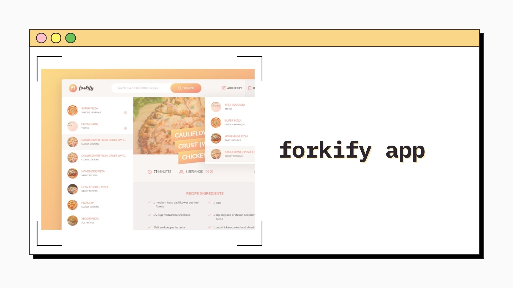

<h1 align="center">Forkify
</h1>

&nbsp;

<h2 align="center"> 
	🚧 Forkify 🟢 Completed 🚀 🚧
</h2>

&nbsp;

<!--
## Table of contents

- [Project description](#description) - [What I learned](#What-I-learned) -->

<h2 id="#description">Project description 📚</h2>

This project is a recipe search app, which has many features like bookmarks, paging and uploading!

&nbsp;

## Functionalities

✔ Search functionality

✔ Display results with pagination

✔ Display recipe with cooking time, servings and ingredients

✔ Change portions functionality: update all ingredients according to current number of servings

✔ Bookmarking functionality

✔ User can upload own recipes

✔ User recipes will be tagged automatically

✔ User can only see their own recipes, not recipes from other users

✔ Store bookmark data in the browser using local storage

✔ On page load, read bookmarks saved from local storage and view

&nbsp;

## Links

- [Preview Site](https://forkify-vinicius.netlify.app)

## My process

### Built with

- [HTML](https://developer.mozilla.org/en-US/docs/Web/HTML)

- [CSS](https://developer.mozilla.org/en-US/docs/Web/CSS)

- [Flexbox](https://css-tricks.com/snippets/css/a-guide-to-flexbox/)

- [CSS Grid](https://css-tricks.com/snippets/css/complete-guide-grid/)

- [Vanilla Js](http://vanilla-js.com)

- [Parcel](https://parceljs.org)

- [SCSS](https://parceljs.org)

- [MVC](https://en.wikipedia.org/wiki/Model–view–controller)

&nbsp;

## 👨‍💻 Author

- [Frontend Mentor](https://www.frontendmentor.io/profile/viniciusshenri96)
- [Linkedin](https://www.linkedin.com/in/vinícius-henrique-7a2533229/)
